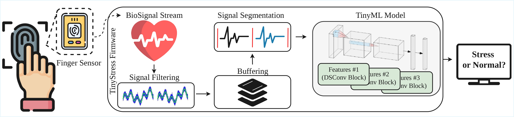
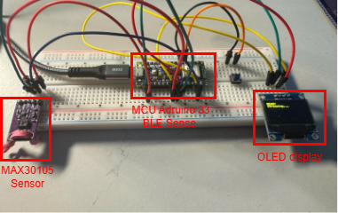

# TinyML for Stress Classification – Reproducibility Guide

This repository contains code, experiments, and notes for an 8-week TinyML/embedded ML project.  
It includes (i) off-device training and simulation, (ii) on-device deployment on Arduino Nano 33 BLE Sense, (iii) model compression (QAT, pruning, distillation), and (iv) system-level profiling and robustness experiments.

---

## Repository Structure (High-Level)

- `Simulation.ipynb`  
  End-to-end notebook covering multiple weeks. Each week is marked by comments:
  `# Start of Week X` / `# End of Week X`.

- `Arduino Code/`  
  On-device deployment code (Nano 33 BLE Sense), including CNN/DSConv pipelines and SVM baselines.

- `Experiments/`  
  Host-side scripts and collected results, including streaming, profiling, and evaluation logs.

---

## Quick Start

### 1) Environment (Host Machine)
- Python 3.x recommended
- Jupyter Notebook (to run `Simulation.ipynb`)

### 2) Hardware (On-Device)
- Arduino Nano 33 BLE Sense
- MAX30105 sensor (PPG)

### 3) Main Entry Points
- Off-device training/simulation: `Simulation.ipynb`
- On-device streaming + profiling: `Experiments/stream_ppg_data.py`
- Arduino sketches: under `Arduino Code/.../*.ino`

---

## Reproducing Results by Week

### Week 1 – Literature Deep Dive (Embedded + TinyML)
**Goal:** Survey TinyML papers, focusing on healthcare applications.  
**Deliverable:** Notes and references (documented in the written summary / paper). (This survey is available at `Documents/Survey_week1.pdf`)  

---

### Week 2 – Baseline ML Model (Off-Device)
**Goal:** Train baseline models on sensor data (off-device).

**Steps:**
1. Open `Simulation.ipynb`
2. Run the section marked:
   `# Start of Week 2` → `# End of Week 2`

---

### Week 3 – First Embedded Deployment (Uncompressed Model)
This week has two components.

#### (A) Simulation / Conversion to TFLite
**Goal:** Convert Week 2 model to an embedded-friendly format (TFLite).

- In `Simulation.ipynb`, run:
  `# Start of Week 3` → `# End of Week 3`

#### (B) Embedded Deployment + Streaming Test
**Arduino (CNN)**
- Sketch:  
  `Arduino Code/Nano_33_ble_1D_cnn (record_data)/nano_33_ble_1D_cnn/`
- Model header: `cnn_1d_float.h`

**Host streaming script**
- Run: `Experiments/stream_ppg_data.py`

---

### Week 4 – Compression & Optimization (Quantization + Extra)
This week has two tracks: offline dataset experiments and real-time self-collected data experiments.

#### (A) Offline Data: QAT, Pruning, Distillation
**Goal:** Compress the Week 2 model using:
1) Quantization-Aware Training (QAT)  
2) Structured pruning  
3) Knowledge distillation  
(Unstructured pruning is also included.)

- In `Simulation.ipynb`, run:
  `# Start of Week 4` → `# End of Week 4`

**Embedded models**
- Sketch path:  
  `Arduino Code/Nano_33_ble_1D_cnn (record_data)/nano_33_ble_1D_cnn/`
- Example model headers:  
  `cnn_1d_float/int8.h`, `cnn_1d_distill_float/int8.h`, `cnn_1d_struct_pruned_float/int8.h`, ...

#### (B) Real-Time Data: Self-Collected Dataset + Classical ML (SVM)
**Goal:** Collect PPG data using MAX30105 and deploy a classical ML baseline (SVM) due to limited data volume.

1. **Collect data (Arduino)**
   
   - Sketch: `Arduino Code/example/colect_data/collect_data.ino`
   
   - Output data stored under: `Arduino Code/example/colect_data/`
     
     (all of self-collected dataset available at `Arduino Code/Self-collected Dataset`)

3. **Train SVM (host)**
   - Script: `Arduino Code/Nano_33_ble_SVM (classical ML)/train_model.py`

4. **Deploy SVM on-device**
   - Sketch: `Arduino Code/Nano_33_ble_SVM (classical ML)/SVM_live/SVM_live.ino`
   - Model header: `linear_svm_params.h`

5. **Run streaming experiment**
   - Script: `Experiments/stream_ppg_data.py`

---

### Week 5 – System-Level Profiling & Robustness
This week has two components.

#### (A) Embedded Profiling: Sampling Rate, Hop Size, and Bursty Pipelines
**Goal:** Evaluate system behavior under different deployment conditions:
- Changing sampling rate (Fs)
- Changing hop size / batch behavior
- Bursty dataflow variants:
  - **A1:** Burst on PC sender (UART bursty arrival with the same average Fs)
  - **A2:** Burst on MCU inference (batch multiple windows and run inference back-to-back)

**Arduino**
- Sketch:
  `Arduino Code/Nano_33_ble_1D_cnn (record_data)/nano_33_ble_1D_cnn_batch_size_change` for Changing Fs experiment.
  `Arduino Code/Nano_33_ble_1D_cnn (record_data)/nano_33_ble_1D_cnn` for others.
- Model header: `cnn_1d_float.h`

**Host**
- Run: `Experiments/stream_ppg_data.py`

**Results**
- `Experiments/ppg_Fs_runs/` (sampling rate)
- `Experiments/ppg_hop_runs/` (hop size)
- `Experiments/ppg_A1_uart_burst/` (A1)
- `Experiments/ppg_A2_runs/` (A2)

#### (B) Simulation Robustness: Noise + Missing Data
**Goal:** Stress-test robustness using:
1) Additive Gaussian noise with different noise level.  
2) Missing data patterns + some recovery strategies.

- In `Simulation.ipynb`, run:
  `# Start of Week 5` → `# End of Week 5`

---

### Week 6 – Hypothesis-Driven Co-Design (New Variant)
This week has two components.

#### (A) Embedded DSConv Variant + Resource Profiling
**Goal:** Deploy DSConv-based model and record:
inference latency, energy proxy, Flash, and RAM usage.

- Arduino sketch:  
  `Arduino Code/Nano_33_ble_1D_cnn (record_data)/nano_33_ble_1D_cnn/`
- Model header: `ds_cnn_1d_float.h`
- Host script: `Experiments/stream_ppg_data.py`

#### (B) Simulation Updates
- In `Simulation.ipynb`, run:
  `# Start of Week 6` → `# End of Week 6`

---

### Weeks 7–8 – Writing & Final Synthesis
**Goal:** Produce the final write-up and project synthesis (papers + summary).  
**Deliverables:** Report, slides, and repository cleanup (README, scripts, notes).(This paper is available at `Documents/Paper_week7.pdf`)  

---

## Notes on Reproducibility
- The notebook `Simulation.ipynb` is a single file covering multiple weeks. Use the `# Start/End of Week X` markers to run only the relevant parts.
- For embedded experiments, the host script `Experiments/stream_ppg_data.py` is used to stream/record and log system-level metrics.

